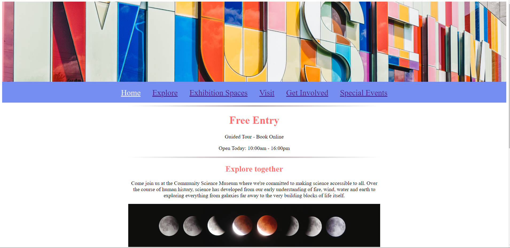

Community-Science-Museum



A simple overview of the use/purpose of the project.

## Description

Community Science Museum is an interactive website designed for a core target audience consisting of primary and middle school children (ages 7-15) and families with young children. 
The aim is to be an informative, appealing website to attract middle school pupils and their parents to the museum.
The website consists of 6 pages.

- Home Page
- Explore
- Exhibition Spaces
- Visit
- Get involved
- Special Events

## Built With

You can list a the tech stack that you've used over here

The webpage was Designed using Wireframes and Prototyping, using the software Adobe XD. 
The hard coding was implemented with HTML and CSS and was performed on the software Visual Studio Code.

- [Wireframes/Prototype](https://www.adobe.com/no/)
- [HTML/CSS](https://getbootstrap.com)

## Getting Started

### Installing

This is where you list how to get the project started. It typically just includes telling a person to clone the repo and then to install the dependencies e.g.

1. Clone the repo:

```bash
gh repo clone Marshflair1988/Community-Science-Museum
```

2. Install the Github Desktop application:

```
Install Github Desktop and link with your github account (https://desktop.github.com/)
```

### Running

Once Github desktop is installed and configurated..
Step 1 - Come back to this repo, Click on code and select open with Github Desktop
Step 2 - Once github desktop has opened, select the Clone option and wait for that to finish cloning.
Step 3 - Click open with visual studio code to get the raw code data up.


## Contributing

Make sure that any editing done on the repo is documented and make sure to push your changes to the github repo.

## Contact

Socials:

[My Twitter page](http://www.twitter.com/OnlyMarsh)

[My LinkedIn page](http://www.linkedin.com/in/mwoolgar)

